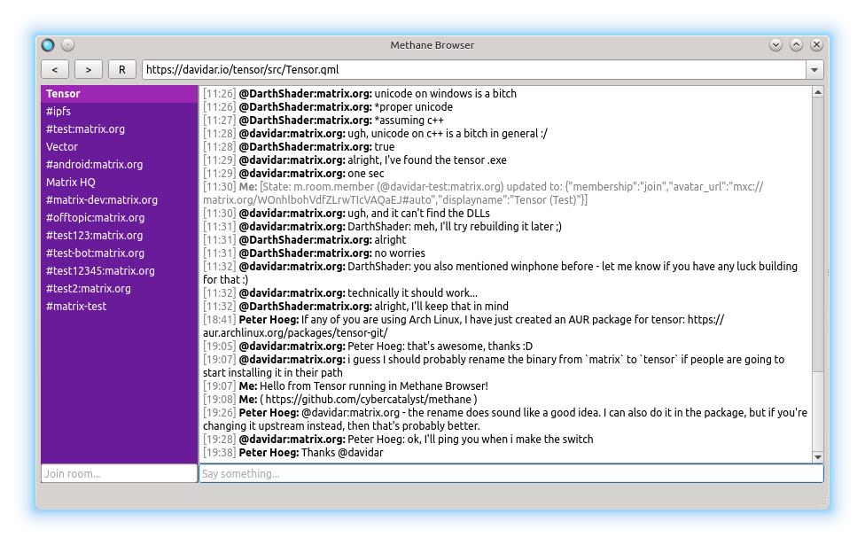

# Tensor
Cross-platform QML-based [Matrix](https://matrix.org) client

# Building
- Clone submodules: `git submodule update --init` (or `git clone --recursive` this repo)
- Install [Qt5](http://www.qt.io/download-open-source/)
- Build according to the instructions for your platform:
  - Desktop: `qmake && make` (or build with [Qt Creator](http://www.qt.io/ide/))
    - Windows: make sure [OpenSSL](https://slproweb.com/products/Win32OpenSSL.html) is installed
  - [Android](http://doc.qt.io/qt-5/androidgs.html)
  - Other platforms: [submit an issue](https://github.com/davidar/tensor/issues) ;)

# Usage
Run `./tensor`, fill in your account details, hit enter, join the `#tensor:matrix.org` room, and start chatting ;)

# Screenshots
## Android Lollipop

## Ubuntu Phone

## SailfishOS

## KDE 4

## OS X

## Windows 7

## Methane Browser

