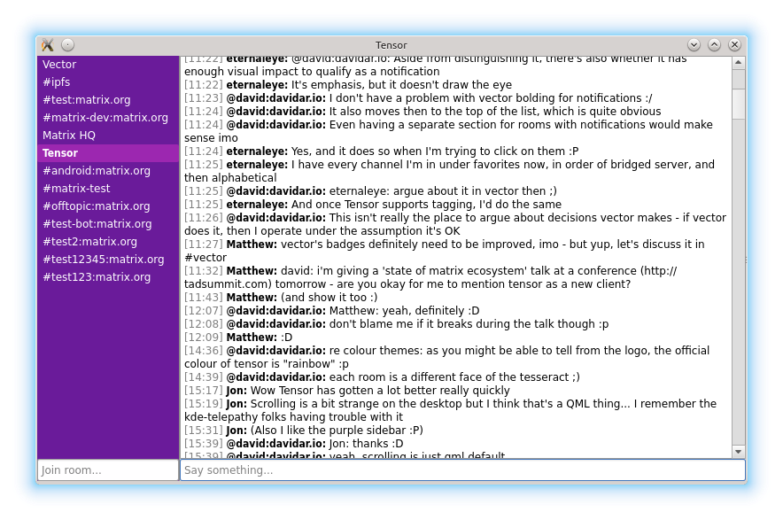

# Tensor
Cross-platform QML-based [Matrix](https://matrix.org) client

# Building

- Install [Qt5](http://www.qt.io/download-open-source/)
- Build according to the instructions for your platform:
  - Desktop: `qmake && make`
  - [Android](http://doc.qt.io/qt-5/androidgs.html)
  - Other platforms: [submit an issue](https://github.com/davidar/tensor/issues) ;)

# Usage

Run `./matrix`, fill in your account details, hit enter, and start chatting ;)

# Screenshots

